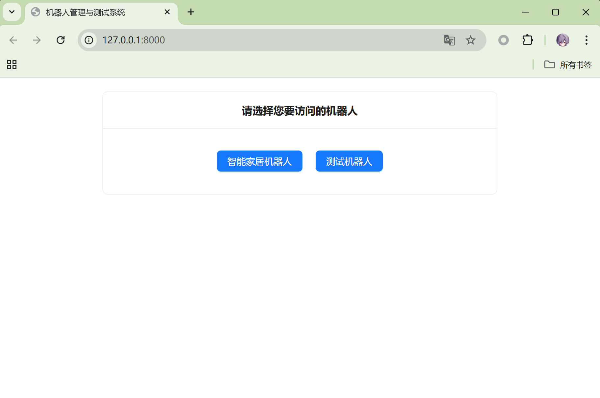
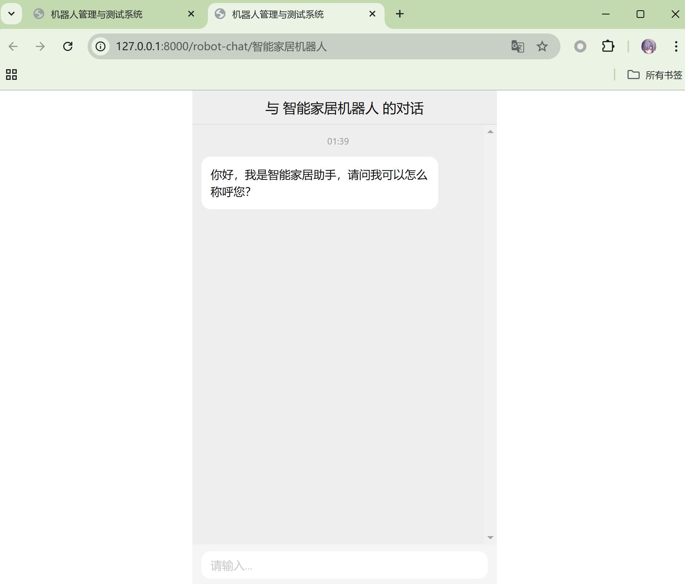
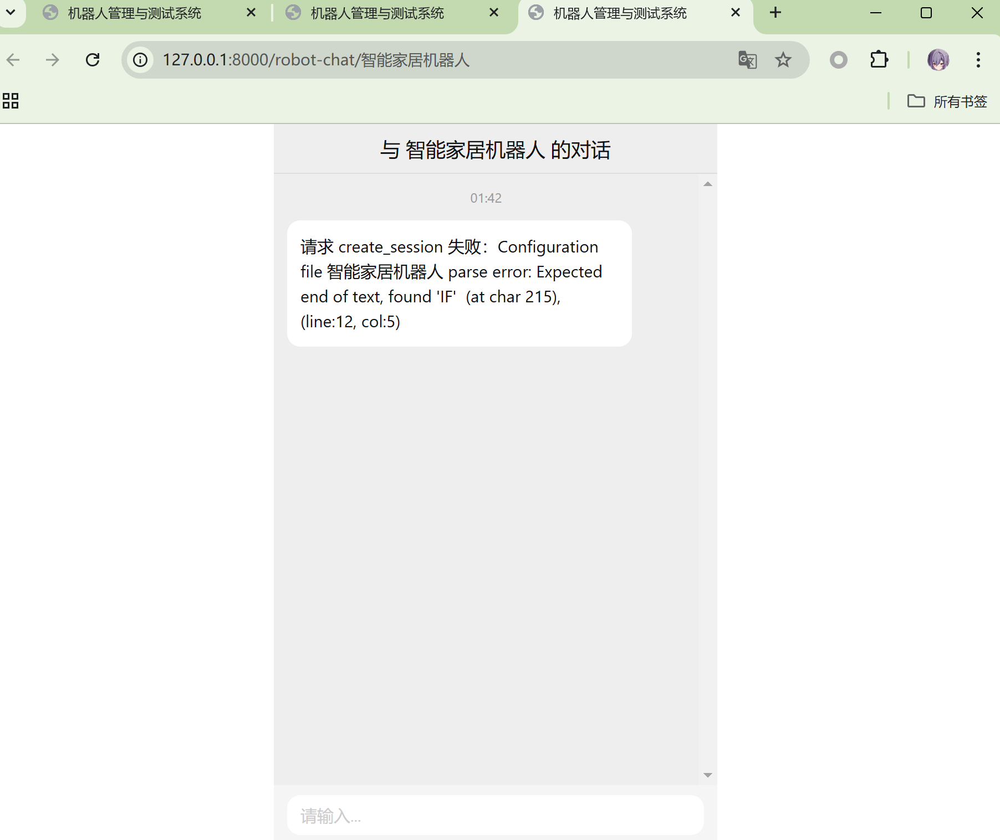

# Robot_DSL

# 运行说明
`test.py`是自动测试脚本，可以自动运行所有测试用例
`run.py`是程序入口，通过`python run.py`运行程序后，会先进行测试，测试通过后，会启动服务，监听本地的`8000`端口，通过浏览器访问`http://127.0.0.1:8000/`查看页面

在Windows下，在根目录执行以下PowerShell命令可以自动运行所有测试用例并启动服务
```shell
$env:PYTHONPATH = "."
python run.py
```

在Linux下，在根目录执行以下Shell命令可以自动运行所有测试用例并启动服务
```shell
export PYTHONPATH=.
python run.py
```

# 代码文件说明
`api`文件夹是前后端交互的接口
+ `api.py`使用`fastapi`框架实现了一个`api_router`，供`run.py`调用

`conf`文件夹包含了所有机器人的配置，可自行添加新的机器人

`controller`文件夹包含了所有的控制器，被各个接口调用
+ `conf_controller.py`是配置控制器，用于读取配置文件
+ `engine_controller.py`是引擎控制器，用于调用执行引擎执行机器人
+ `session_controller.py`是会话控制器，用于处理会话，以支持多用户同时使用

`dist`是前端打包后的文件，包含了所有的静态资源
+ `index.html`是前端页面
+ `assets`是前端的静态资源（js、css）

`engine`是机器人的执行引擎
+ `running_engine.py`是主执行引擎，用于执行机器人
+ `string_operation.py`是字符串操作引擎，用于执行字符串操作
+ `variable_manager.py`是变量管理引擎，用于管理变量
+ `message_handler.py`是消息处理引擎，用于处理和缓存客户端和服务端的消息

`error`包含了所有的错误处理
+ `controller_runtime_error.py`是控制器运行时错误
+ `dsl_runtime_error.py`是DSL运行时错误
+ `parse_error.py`是DSL解析错误
+ `running_error.py`是DSL执行错误

`model`包含了所有的数据模型
+ `dsl_tree.py`是DSL语法树，其中包含了所有的DSL语句模型

`parser`包含了所有的解析器
+ `parse_ask.py`用于解析`ASK`语句
+ `parse_basic_unit.py`用于解析基本单元
+ `parse_exprs`用于解析表达式（包括`ASK`, `OUT`, `IF`, `TRANS`)
+ `parse_out.py`用于解析`OUT`语句
+ `parse_param.py`用于解析`PARAM`语句
+ `parse_state.py`用于解析`STATE`语句
+ `parse_trans.py`用于解析转移语句
+ `parsing.py`是解析器的入口

`testcases`包含了所有的测试用例（共85个测试桩）
+ `enginecases`包含了所有的引擎测试用例
+ `parsercases`包含了所有的解析器测试用例
+ `modelcases`包含了所有的数据模型测试用例、


# DSL语法说明
DSL文件的扩展名为`.czz`，其语法定义如下：

## 1. 关键字
共有以下关键字：
+ `ASK`：用于询问用户输入
+ `OUT`：用于输出
+ `IF`, `ELIF`, `ELSE`：用于条件判断
+ `STATE`：用于定义状态
+ `PARAM`：用于定义变量
+ `INITIAL`: 用于定义初始状态
**注意：**以上关键字均不区分大小写

## 2、基本单元
除了以上关键字外，还有以下基本单元：
+ `=`：赋值，用于PARAM语句
+ `:`：冒号，用于IF、ELIF、ELSE、STATE语句
+ `->`：用于转移和ASK语句
+ `==`, `<>`, `~=`, `>`, `>=`, `<`, `<=`：用于条件判断
+ `;`：分号，用于IF块的结尾以避免歧义
+ `"`, `'`：双引号和单引号，用于字符串
**注意：**`{`, `}`用于字符串内部的变量替换，但是替换是在执行时进行的，而不是在解析时进行的

## 3、标识符
除了关键字和基本单元外，在DSL中出现的其他任何字符都是标识符，我们称为`id`，其BNF定义如下：
```bnf
id ::= letter { letter | digit | "_" }
letter ::= "a" | "b" | ... | "z" | "A" | "B" | ... | "Z"
digit ::= "0" | "1" | ... | "9"
```
也就是说，标识符由字母、数字和下划线组成，且首字符必须是字母

## 4、变量
DSL中的所有变量均为字符串类型，字符串由双引号或单引号包裹，转义字符为`\`，字符串的内部可以包含变量，变量由`{`和`}`包裹，变量的值在执行时进行替换。
你可以通过`PARAM`语句定义变量，通过`{}`拼接变量
若需要直接输出一个变量，请使用`{}`括起来，如`{name}`
`ASK`语句后的变量名会自动赋值为用户输入的字符串，无需预先定义

## 5、表达式
共有四种表达式，分别是：
+ ASK表达式
+ OUT表达式
+ 转移表达式
+ IF表达式

需要注意的是，IF表达式作为一种表达式，其内部可以包含其他表达式，即IF表达式可以嵌套，这是循环定义的，我们通过`pyparsing`的前向引用来解决

我们定义`exprs`为所有表达式的集合
```bnf
exprs ::= ask_expr | out_expr | trans_expr | if_expr
```

下面详细介绍每种表达式的语法

### 5.1、ASK表达式
BNF定义如下：
```bnf
ask_expr ::= "ASK" string_expr "->" id
```
示例：
```czz
ASK "请输入您的姓名" -> name
```
`ASK`表达式用于询问用户输入，用户输入的字符串会赋值给`name`变量，`name`变量无需预先定义

### 5.2、OUT表达式
BNF定义如下：
```bnf
out_expr ::= "OUT" string_expr
```
示例：
```czz
OUT "您好，{name}"
```
`OUT`表达式用于输出字符串，字符串内部可以包含变量，变量由`{}`包裹，变量的值在执行时进行替换

### 5.3、转移
BNF定义如下：
```bnf
trans_expr ::= -> id
```
示例：
```czz
-> end
```
转移表达式用于转移状态，`-> end`表示转移到`end`状态
状态必须预先定义，否则会在运行时抛出`DSLRuntimeError`

### 5.4、IF表达式
BNF定义如下：

```bnf
if_expr ::= "IF" condition ":" exprs { "ELIF" condition ":" exprs } [ "ELSE" ":" exprs ] ";"
condition ::= id ( "==" | "<>" | "~=" | ">" | ">=" | "<" | "<=" ) string_expr
```
**注意：**1、`if_expr`中的`exprs`是一个表达式集合，即可以包含多个表达式，这是为了支持IF嵌套
2、为了避免多层IF嵌套时的歧义，我们在IF块的结尾加上`;`，表示IF块的结束
3、由于我们只有字符串类型的变量，为了支持数字比较，在处理`>`, `>=`, `<`, `<=`和`<>`时，如果两端的字符串可以转换为数字，则按数字比较，否则按字符串比较
4、`~=`表示正则匹配，即左边的字符串是否匹配右边的正则表达式

示例：
```czz
IF age < "18":
    OUT "你还是个小孩子"
ELIF age < "40":
    OUT "你已经是个青年人了"
ELSE:
    OUT "你已经是个老人了"
;
```

## 6、状态
状态由`STATE`关键字定义，其后跟着状态名和`:`，状态名必须是标识符，状态内部包含多个表达式，状态的定义如下：
```bnf
state ::= "STATE" id ":" exprs
```
DSL中必须有一个初始状态，即`INITIAL`状态，作为程序的入口

示例：
```czz
STATE INITIAL:
    ASK "请输入您的姓名" -> name
    OUT "您好，{name}"
    IF age < "18":
        OUT "你还是个小孩子"
    ELIF age < "40":
        OUT "你已经是个青年人了"
    ELSE:
        OUT "你已经是个老人了"
    ;
```

## 7、参数
`PARAM`关键字用于定义变量，它不作为表达式，而是和`STATE`并列，其定义如下：
```bnf
param ::= "PARAM" id "=" string_expr
```
也就是说，所有的参数定义必须在外层，不能在状态内部定义

示例：
```czz
PARAM age = "18"
PARAM name = "小明"
```

## 8、注释
DSL支持单行注释，以`#`开头，直到行尾结束，和Python的注释一样


## 9、总定义
综上，DSL的总定义如下：
```bnf
dsl ::= { param | state | comment }
```

示例机器人：
```czz
PARAM robot = "测试机器人"

STATE INITIAL:
    OUT "你好，我是{robot}"
    ASK "你今年几岁了" -> age
    IF age < "18":
        OUT "你还是个小孩子"
    ELIF age < "40":
        OUT "你已经是个青年人了"
    ELSE:
        OUT "你已经是个老人了"
    ;
```

该机器人会问用户的年龄，然后根据年龄输出不同的信息

## 10、错误处理
如果DSL语法错误，会抛出`ParseError`，提示语法错误

# DSL执行引擎
为了让您更好地理解DSL的执行过程，我们简单介绍一下DSL的执行引擎

程序入口：名为`INITIAL`的状态，即初始状态，程序从这里开始执行
何时结束：如果已经运行到任何一个状态结尾，而没有任何转移，则程序结束
总流程：执行引擎从INITIAL状态开始执行，执行INITIAL状态内的表达式，然后根据转移表达式转移到下一个状态，然后执行下一个状态内的表达式，如此循环，直到程序结束

错误说明：
+ 如果没有开始状态：抛出`NoInitialStateError`，提示没有初始状态
+ 如果需要替换的变量不存在：抛出`VariableNotFoundError`，提示变量不存在
+ 如果转移的状态不存在：抛出`NoStateMatchedError`，提示状态不存在
+ 如果没有状态被定义：抛出`NoStateDefinedError`，提示没有状态被定义

这些错误都在`error/dsl_runtime_error.py`中定义

# 使用说明
1、将DSL文件放入`conf`文件夹中
2、根据运行说明运行程序
3、使用浏览器打开`http://127.0.0.1:8000/`，即可看到页面

页面如下：



卡片中会显示所有机器人的名字，点击按钮即可进入各个机器人页面，页面如下：



在输入框中输入你想输入的内容，点击发送即可看到机器人的回复，机器人退出后，会有`对话已结束，无法再输入内容。`的提示，此时无法再发送消息

如果您编写的DSL有语法错误，会在页面上显示错误信息，其他错误（如`dsl_runtime_error`），也会在页面上显示错误信息，方便您调试，这些错误和配置文件是动态的，也就是说，您可以在不重启服务的情况下修改配置文件和DSL文件，然后刷新页面即可看到最新的效果

