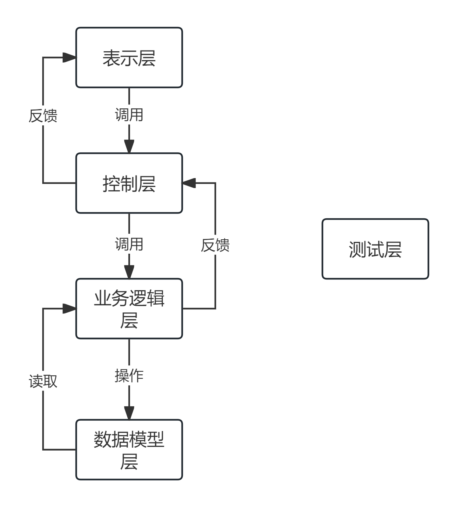

# Robot_DSL

# 运行说明
`test.py`是自动测试脚本，可以自动运行所有测试用例
`run.py`是程序入口，通过`python run.py`运行程序后，会先进行测试，测试通过后，会启动服务，监听本地的`8000`端口，通过浏览器访问`http://127.0.0.1:8000/`查看页面

在Windows下，在根目录执行以下PowerShell命令可以自动运行所有测试用例并启动服务
```shell
$env:PYTHONPATH = "."
python run.py
```

在Linux下，在根目录执行以下Shell命令可以自动运行所有测试用例并启动服务
```shell
export PYTHONPATH=.
python run.py
```

# 代码文件说明
`api`文件夹是前后端交互的接口
+ `api.py`使用`fastapi`框架实现了一个`api_router`，供`run.py`调用

`conf`文件夹包含了所有机器人的配置，可自行添加新的机器人

`controller`文件夹包含了所有的控制器，被各个接口调用
+ `conf_controller.py`是配置控制器，用于读取配置文件
+ `engine_controller.py`是引擎控制器，用于调用执行引擎执行机器人
+ `session_controller.py`是会话控制器，用于处理会话，以支持多用户同时使用

`dist`是前端打包后的文件，包含了所有的静态资源
+ `index.html`是前端页面
+ `assets`是前端的静态资源（js、css）

`engine`是机器人的执行引擎
+ `running_engine.py`是主执行引擎，用于执行机器人
+ `string_operation.py`是字符串操作引擎，用于执行字符串操作
+ `variable_manager.py`是变量管理引擎，用于管理变量
+ `message_handler.py`是消息处理引擎，用于处理和缓存客户端和服务端的消息

`error`包含了所有的错误处理
+ `controller_runtime_error.py`是控制器运行时错误
+ `dsl_runtime_error.py`是DSL运行时错误
+ `parse_error.py`是DSL解析错误
+ `running_error.py`是DSL执行错误

`model`包含了所有的数据模型
+ `dsl_tree.py`是DSL语法树，其中包含了所有的DSL语句模型

`parser`包含了所有的解析器
+ `parse_ask.py`用于解析`ASK`语句
+ `parse_basic_unit.py`用于解析基本单元
+ `parse_exprs`用于解析表达式（包括`ASK`, `OUT`, `IF`, `TRANS`)
+ `parse_out.py`用于解析`OUT`语句
+ `parse_param.py`用于解析`PARAM`语句
+ `parse_state.py`用于解析`STATE`语句
+ `parse_trans.py`用于解析转移语句
+ `parsing.py`是解析器的入口

`testcases`包含了所有的测试用例（共85个测试桩）
+ `enginecases`包含了所有的引擎测试用例
+ `parsercases`包含了所有的解析器测试用例
+ `modelcases`包含了所有的数据模型测试用例、


# DSL语法说明
DSL文件的扩展名为`.czz`，其语法定义如下：

## 1. 关键字
共有以下关键字：
+ `ASK`：用于询问用户输入
+ `OUT`：用于输出
+ `IF`, `ELIF`, `ELSE`：用于条件判断
+ `STATE`：用于定义状态
+ `PARAM`：用于定义变量
+ `INITIAL`: 用于定义初始状态
**注意：**以上关键字均不区分大小写

## 2、基本单元
除了以上关键字外，还有以下基本单元：
+ `=`：赋值，用于PARAM语句
+ `:`：冒号，用于IF、ELIF、ELSE、STATE语句
+ `->`：用于转移和ASK语句
+ `==`, `<>`, `~=`, `>`, `>=`, `<`, `<=`：用于条件判断
+ `;`：分号，用于IF块的结尾以避免歧义
+ `"`, `'`：双引号和单引号，用于字符串
**注意：**`{`, `}`用于字符串内部的变量替换，但是替换是在执行时进行的，而不是在解析时进行的

## 3、标识符
除了关键字和基本单元外，在DSL中出现的其他任何字符都是标识符，我们称为`id`，其BNF定义如下：
```bnf
id ::= letter { letter | digit | "_" }
letter ::= "a" | "b" | ... | "z" | "A" | "B" | ... | "Z"
digit ::= "0" | "1" | ... | "9"
```
也就是说，标识符由字母、数字和下划线组成，且首字符必须是字母

## 4、变量
DSL中的所有变量均为字符串类型，字符串由双引号或单引号包裹，转义字符为`\`，字符串的内部可以包含变量，变量由`{`和`}`包裹，变量的值在执行时进行替换。
你可以通过`PARAM`语句定义变量，通过`{}`拼接变量
若需要直接输出一个变量，请使用`{}`括起来，如`{name}`
`ASK`语句后的变量名会自动赋值为用户输入的字符串，无需预先定义

## 5、表达式
共有四种表达式，分别是：
+ ASK表达式
+ OUT表达式
+ 转移表达式
+ IF表达式

需要注意的是，IF表达式作为一种表达式，其内部可以包含其他表达式，即IF表达式可以嵌套，这是循环定义的，我们通过`pyparsing`的前向引用来解决

我们定义`exprs`为所有表达式的集合
```bnf
exprs ::= ask_expr | out_expr | trans_expr | if_expr
```

下面详细介绍每种表达式的语法

### 5.1、ASK表达式
BNF定义如下：
```bnf
ask_expr ::= "ASK" string_expr "->" id
```
示例：
```czz
ASK "请输入您的姓名" -> name
```
`ASK`表达式用于询问用户输入，用户输入的字符串会赋值给`name`变量，`name`变量无需预先定义

### 5.2、OUT表达式
BNF定义如下：
```bnf
out_expr ::= "OUT" string_expr
```
示例：
```czz
OUT "您好，{name}"
```
`OUT`表达式用于输出字符串，字符串内部可以包含变量，变量由`{}`包裹，变量的值在执行时进行替换

### 5.3、转移
BNF定义如下：
```bnf
trans_expr ::= -> id
```
示例：
```czz
-> end
```
转移表达式用于转移状态，`-> end`表示转移到`end`状态
状态必须预先定义，否则会在运行时抛出`DSLRuntimeError`

### 5.4、IF表达式
BNF定义如下：

```bnf
if_expr ::= "IF" condition ":" exprs { "ELIF" condition ":" exprs } [ "ELSE" ":" exprs ] ";"
condition ::= id ( "==" | "<>" | "~=" | ">" | ">=" | "<" | "<=" ) string_expr
```
**注意：**1、`if_expr`中的`exprs`是一个表达式集合，即可以包含多个表达式，这是为了支持IF嵌套
2、为了避免多层IF嵌套时的歧义，我们在IF块的结尾加上`;`，表示IF块的结束
3、由于我们只有字符串类型的变量，为了支持数字比较，在处理`>`, `>=`, `<`, `<=`和`<>`时，如果两端的字符串可以转换为数字，则按数字比较，否则按字符串比较
4、`~=`表示正则匹配，即左边的字符串是否匹配右边的正则表达式

示例：
```czz
IF age < "18":
    OUT "你还是个小孩子"
ELIF age < "40":
    OUT "你已经是个青年人了"
ELSE:
    OUT "你已经是个老人了"
;
```

## 6、状态
状态由`STATE`关键字定义，其后跟着状态名和`:`，状态名必须是标识符，状态内部包含多个表达式，状态的定义如下：
```bnf
state ::= "STATE" id ":" exprs
```
DSL中必须有一个初始状态，即`INITIAL`状态，作为程序的入口

示例：
```czz
STATE INITIAL:
    ASK "请输入您的姓名" -> name
    OUT "您好，{name}"
    IF age < "18":
        OUT "你还是个小孩子"
    ELIF age < "40":
        OUT "你已经是个青年人了"
    ELSE:
        OUT "你已经是个老人了"
    ;
```

## 7、参数
`PARAM`关键字用于定义变量，它不作为表达式，而是和`STATE`并列，其定义如下：
```bnf
param ::= "PARAM" id "=" string_expr
```
也就是说，所有的参数定义必须在外层，不能在状态内部定义

示例：
```czz
PARAM age = "18"
PARAM name = "小明"
```

## 8、注释
DSL支持单行注释，以`#`开头，直到行尾结束，和Python的注释一样


## 9、总定义
综上，DSL的总定义如下：
```bnf
dsl ::= { param | state | comment }
```

示例机器人：
```czz
PARAM robot = "测试机器人"

STATE INITIAL:
    OUT "你好，我是{robot}"
    ASK "你今年几岁了" -> age
    IF age < "18":
        OUT "你还是个小孩子"
    ELIF age < "40":
        OUT "你已经是个青年人了"
    ELSE:
        OUT "你已经是个老人了"
    ;
```

该机器人会问用户的年龄，然后根据年龄输出不同的信息

## 10、错误处理
如果DSL语法错误，会抛出`ParseError`，提示语法错误

# DSL执行引擎
为了让您更好地理解DSL的执行过程，我们简单介绍一下DSL的执行引擎

程序入口：名为`INITIAL`的状态，即初始状态，程序从这里开始执行
何时结束：如果已经运行到任何一个状态结尾，而没有任何转移，则程序结束
总流程：执行引擎从INITIAL状态开始执行，执行INITIAL状态内的表达式，然后根据转移表达式转移到下一个状态，然后执行下一个状态内的表达式，如此循环，直到程序结束

错误说明：
+ 如果没有开始状态：抛出`NoInitialStateError`，提示没有初始状态
+ 如果需要替换的变量不存在：抛出`VariableNotFoundError`，提示变量不存在
+ 如果转移的状态不存在：抛出`NoStateMatchedError`，提示状态不存在
+ 如果没有状态被定义：抛出`NoStateDefinedError`，提示没有状态被定义

这些错误都在`error/dsl_runtime_error.py`中定义

# 使用说明
1、将DSL文件放入`conf`文件夹中
2、根据运行说明运行程序
3、使用浏览器打开`http://127.0.0.1:8000/`，即可看到页面

页面如下：


卡片中会显示所有机器人的名字，点击按钮即可进入各个机器人页面，页面如下：


在输入框中输入你想输入的内容，点击发送即可看到机器人的回复，机器人退出后，会有`对话已结束，无法再输入内容。`的提示，此时无法再发送消息

如果您编写的DSL有语法错误，会在页面上显示错误信息，其他错误（如`dsl_runtime_error`），也会在页面上显示错误信息，方便您调试，这些错误和配置文件是动态的，也就是说，您可以在不重启服务的情况下修改配置文件和DSL文件，然后刷新页面即可看到最新的效果


# 代码风格

`PEP8` 是 `Python` 官方推荐的代码风格指南，代码风格完全遵循`PEP8`规范，具体如下

## 注释
+ 单行注释：使用`#`，注释符后空一格
  + 对于一些重要变量，会在其右方加上单行注释，说明其含义
+ 多行注释：使用多行字符串，即`'''`或`"""`
  + 每个函数、类、模块的开头都包含一个三重引号的字符串，用于说明该函数、类、模块的功能，这是Python的官方规范，我们也遵循这个规范


注释简洁明了，解释为什么而非怎么做，不写无意义的注释

## 命名
+ 模块名：使用小写字母，单词之间用下划线分隔（下划线命名法），如`engine_controller.py`
+ 类名：使用大驼峰命名法，即每个单词首字母大写，如`RunningEngine`
+ 变量和函数名：使用小写字母，单词之间用下划线分隔（下划线命名法），如`get_dsl_tree`
+ 常量：使用大写字母，单词之间用下划线分隔（下划线命名法），如`MAX_LENGTH`
+ 文件夹名：使用小写字母，单词之间用下划线分隔（下划线命名法），如`testcases`

所有命名均能清楚表达其含义，不使用拼音或缩写，例如，所有函数名均为动词+名词的形式，如`get_dsl_tree`，`parse_dsl`等

同时，将一些具有类似功能的模块放在同一个文件夹下，如`controller`文件夹下的所有控制器，`parser`文件夹下的所有解析器

## 缩进
+ 使用4个空格进行缩进，不使用制表符

## 空行
+ 顶层定义（函数、类之间）使用两个空行分隔。
+ 类内部方法之间使用一个空行。

## 导入语句
+ 导入语句分为三块，每块之间用一个空行分隔
  + Python标准库导入
  + 第三方库导入
  + 本地库导入

## 空格
+ 二元运算符两侧各加一个空格，如`a = b + c`
+ 逗号后加一个空格，如`print(a, b)`
+ 冒号后加一个空格，如`if a:`

## 其他
对于大部分函数，对参数和返回值均进行了`类型注解`，以方便阅读和调试


# 设计和实现

## 数据结构

### DSL语法树

DSL语法树是最重要的数据结构，它是DSL的抽象语法树，包含了所有的DSL语句模型，程序会首先解析DSL文件，生成DSL语法树，然后执行引擎会根据DSL语法树执行DSL文件

DSL语法树的模型定义位于`model/dsl_tree.py`，该模型使用`pydantic`库定义，包含如下语句模型

+ `PARAM`类: 参数语句模型
  + `param`: 参数名
  + `value`: 参数值
+ `OUT`类: 输出语句模型
  + `out`: 输出的字符串
  + `get_out()`: 获取输出的字符串
+ `ASK`类: 询问语句模型
  + `ask`: 询问的字符串
  + `save_to`: 保存到的变量名
  + `get_ask()`: 获取询问的字符串
  + `get_save_to()`: 获取保存到的变量名
+ `TRANS`类: 转移语句模型
  + `trans`: 转移到的状态名
  + `get_trans()`: 获取转移到的状态名
+ `JUDGE`类: 判断语句模型
  + `if_`: IF语句
  + `elif_`: ELIF语句
  + `else_`: ELSE语句
  + `get_if()`: 获取IF语句
  + `get_elif()`: 获取ELIF语句
  + `get_else()`: 获取ELSE语句
  + `has_else()`: 判断是否有ELSE语句
  + `elif_iter()`: ELIF语句迭代器
+ `CONDITION`类: 条件模型
  + `key`: 条件左边的变量名
  + `judge`: 条件判断符，如`==`, `>`, `<=`等
  + `value`: 条件右边的值
+ `IF_`类: IF语句模型
+ `ELIF_`类: ELIF语句模型
  + `condition`: 条件模型
  + `exprs`: 表达式集合
  + `get_condition()`: 获取条件模型
  + `expr_iter()`: 表达式集合迭代器
+ `ELSE_`类: ELSE语句模型
  + `exprs`: 表达式集合
  + `expr_iter()`: 表达式集合迭代器
+ `STATE`类: 状态模型
  + `state`: 状态名
  + `exprs`: 表达式集合
  + `get_state_name()`: 获取状态名
  + `expr_iter()`: 表达式集合迭代器

需要说明的是，由于`JUDGE`类需要引用`IF_`, `ELIF_`, `ELSE_`类，而`IF_`, `ELIF_`, `ELSE_`类中的`exprs`又需要引用`JUDGE`类，这是循环引用，在文法定义中，我们使用`pyparsing`的前向引用来解决这个问题，在此处，我们使用`pydantic`的前向引用来解决这个问题

根据文法定义，该DSL由若干`PARAM`和`STATE`组成，所以DSL语法树类`DSLTree`定义如下：
```python
class DSLTree(ConfigedBaseModel):
    DSLTree: List[Union[PARAM, STATE]]
```
有如下方法：
+ `has_param(self)`: 判断是否有参数
+ `has_state(self)`: 判断是否有状态
+ `param_iter(self)`: 参数迭代器
+ `state_iter(self)`: 状态迭代器
+ `get_state(self, state_name: str)`: 获取指定状态
+ `check_state(self)`: 模型验证方法，用于检查DSL语法树的合法性

当模型创建后，`pydatnic`会自动调用`check_state`方法，检查DSL语法树的合法性，如果没有状态被定义，会抛出`NoStateDefinedError`，如果没有初始状态，会抛出`NoInitialStateError`

在`get_state`方法中，会根据状态名获取指定状态，如果状态不存在，会抛出`NoStateMatchedError`

此外，还有一个静态方法`serialize`，用于将字典转换为DSL语法树模型，`parsing`模块会先将DSL解析为字典，然后再转换为DSL语法树模型

下面给出一个DSL语法树的示例：

DSL如下：
```czz
PARAM robot = "测试机器人"

STATE INITIAL:
    OUT "你好，我是{robot}"
    ASK "你今年几岁了" -> age
    IF age < "18":
        OUT "你还是个小孩子"
    ELIF age < "40":
        OUT "你已经是个青年人了"
    ELSE:
        OUT "你已经是个老人了"
    ;
```


语法树如下：
```python
DSLTree=[PARAM(param='robot', value='测试机器人'), STATE(state='INITIAL', exprs=[OUT(out='你好，我是{robot}'), ASK(ask='你今年几岁了', save_to='age'), JUDGE(if_=IF_(condition=CONDITION(key='age', judge='<', value='18'), exprs=[OUT(out='你还是个小孩子')]), elif_=[ELIF_(condition=CONDITION(key='age', judge='<', value='40'), exprs=[OUT(out='你已经是个青年人了')])], else_=ELSE_(exprs=[OUT(out='你已经是个老人了')]))])]
```

## 模块划分

本项目共有`api`、`controller`、`engine`、`error`、`model`、`parser`、`testcases`、`dist`八个模块

采用分层架构，分为**表示层、控制层、业务逻辑层、数据模型层、测试层**

+ 数据模型层：`error`、`model`
+ 业务逻辑层：`engine`、`parser`
+ 控制层：`controller`
+ 表示层：`api`、`dist`
+ 测试层：`testcases`

分层图如下



### 数据模型层

负责数据的存储和处理，包含了所有的数据模型，如DSL语法树模型、错误模型等，以及数据的验证和处理方法

`model`模块存储了所有的数据模型，`error`模块存储了所有的错误模型，具体如下
+ `model/dsl_tree.py`：DSL语法树模型
+ `error/dsl_runtime_error.py`：DSL运行时错误模型
+ `error/parse_error.py`：DSL解析错误模型
+ `error/controller_runtime_error.py`：控制器运行时错误模型
+ `error/parse_error.py`：解析器运行时错误模型

模型已经在数据结构中介绍，这里不再赘述

### 业务逻辑层

实现了DSL的解析和执行，包含了所有的解析器和执行引擎

`engine`模块为DSL的执行引擎，`parser`模块为DSL的解析器，具体如下
+ `engine/running_engine.py`：主执行引擎，用于执行DSL
+ `engine/string_operation.py`：字符串操作引擎，用于执行字符串操作
+ `engine/variable_manager.py`：变量管理引擎，用于管理变量
+ `engine/message_handler.py`：消息处理引擎，用于处理和缓存客户端和服务端的消息
+ `parser/parse_ask.py`：ASK语句解析器
+ `parser/parse_basic_unit.py`：基本单元解析器
+ `parser/parse_exprs.py`：表达式解析器
+ `parser/parse_out.py`：OUT语句解析器
+ `parser/parse_param.py`：PARAM语句解析器
+ `parser/parse_state.py`：STATE语句解析
+ `parser/parse_judge.py`：判断语句解析器
+ `parser/parse_trans.py`：转移语句解析器
+ `parser/parsing.py`：解析器入口

### 控制层
用于协调API请求，将请求转发给业务逻辑层，然后将结果返回给表示层

`controller`模块包含了所有的控制器，具体如下
+ `controller/conf_controller.py`：配置控制器，用于读取配置文件
+ `controller/engine_controller.py`：引擎控制器，用于调用执行引擎执行机器人
+ `controller/session_controller.py`：会话控制器，用于处理会话，以支持多用户同时使用

### 表示层
提供视图，将数据呈现给用户，同时还包含前后端交互的接口
`dist`为使用`React`框架编写的前端页面打包后的文件
+ `dist/index.html`：前端页面
+ `dist/assets`：前端静态资源（js、css）

`api`中使用`fastapi`框架实现了一个`api_router`，供`run.py`调用
+ `api/api.py`：API接口


### 测试层
包含了所有的测试用例，使用`pytest`框架进行测试，`test.py`为自动测试脚本。
+ `testcases/enginecases`：包含了所有的引擎测试用例
+ `testcases/parsercases`：包含了所有的解析器测试用例
+ `testcases/modelcases`：包含了所有的数据模型测试用例